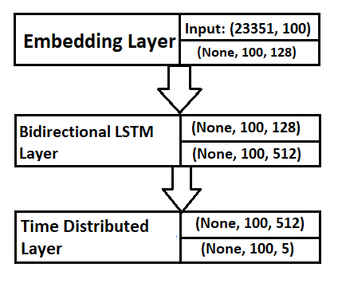
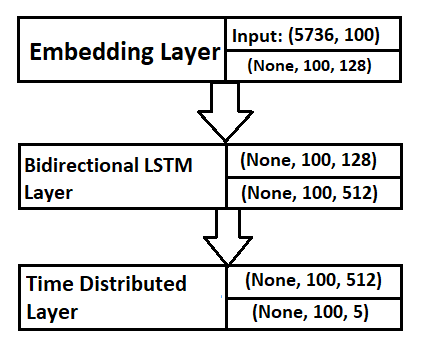
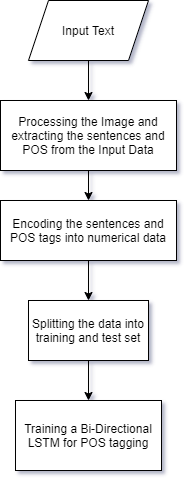
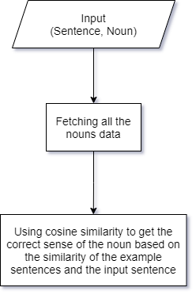

<div align="center"><h1>Marathi Word Sense Disambiguation</h1></div>

## Approach

1. All the sentences along with their Parts of Speech (POS) tags are seperated from the textual data from each Domain (Health, News, Tourism).

2. Converting the textual data to numerical data by assigning index to each word.

3. Training a Bi-Directional LSTM model to predict the POS tag for a word.

4. Seperating the nouns, verbs, adverbs and adjectives.

5. Loading the nouns data containing all the senses along with some example sentences.

6. Using cosine similarity to find the correct sense of the noun from the input sentence.

## Instructions to run the Application
1. Open the project folder and Install all the dependencies by running this command in command prompt:

```
pip install requirements.txt
```

2. After successfully installing all the dependencies, get the "WordSenseDisambiguationModel" folder from the drive, unzip it and put it in this current directory i.e. directory with main.py file and run the following command to start the application:

```
python main.py
```


## Questions and Answers

1. <b>Which technique use in embedding layer?</b><br/>
Keras Embedding Layer was used which is trained during the model training process.

2. <b>Which activation function used?</b><br/>
Softmax Activation Function was used to the predict the output classes. Softmax axtivation function preduces a probability value between 0 to 1 for each class. The class with highest probability is the predicted class.

3. <b>What is the size of input matrix?</b><br/>
The input matrix was different for each domain (Tourism, Health, News) model. <br>
The input shapes are of the form (Number of sentences, Length of the sentences)<br/>
Tourism Domain: (22940, 113)<br/>
Health Domain: (9948, 100)<br/>
News Domain: (765, 129)

4. <b>How many hidden layer in NN model?</b><br/>
The Neural Network (NN) Model has one hidden Bi-Directional LSTM layer. Bi-Directional LSTM was used beacause these layers perform well in preserving the past data.

5. <b>How many gated memory unit per layer?</b><br/>
The number of gated memory units used is as follows:<br/>
Tourism Domain: 512<br/>
Health Domain: 256<br/>
News Domain: 512


6. <b>Which optimization applied to update weights among the different layer?</b><br/>
Adam optimizer with learning rate of 0.001 was used to update the weights among different layers.


7. <b>How many epoch is used to Training the model?</b><br/>
The number of epochs used for training the models are:<br/>
Tourism Domain: 10 epochs<br/>
Health Domain: 15 epochs<br/>
News Domain: 60 epochs

8. <b>What is the batch size?</b><br/>
The batch size used for training the models are:<br/>
Tourism Domain: 128<br/>
Health Domain: 128<br/>
News Domain: 128


9. <b>Which loss function is used?</b><br/>
categorical crossentropy was used as loss function. It is well suited for classification tasks involving classification of multiple classes.


## Architectures
#### POS tagging model for Health Domain
<div align="center">
    
</div>

#### POS tagging model for Tourism Domain
<div align="center">
    
</div>

#### POS tagging model for News Domain
<div align="center">
    
</div>

## Flow Chart for POS Tagging
<div align="center"></div>

## Flow Chart for Word Sense Disambiguation
<div align="center">
    
</div>